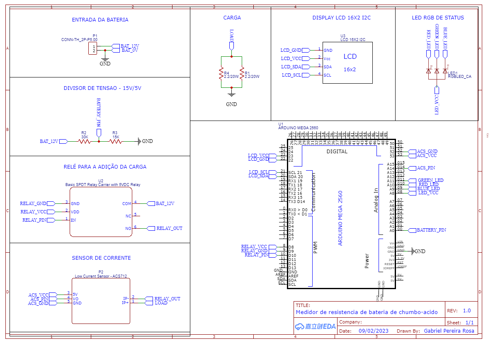


# Medidor de resistência para bateria de chumbo-ácido   

Esse projeto tem como objetivo obter a resistência de uma bateria de chumbo-ácido utilizando o método DC.

Os materiais utilizados no projeto são:

- 1 Arduino MEGA 2560
- 1 Relé 5V 
- 1 Sensor de corrente ACS712 20A
- 2 Resistores de 2.2/20W
- 1 Led RGB Anodo Comum
- 1 Display LCD 16x2 I2C
 
## Esquemático

